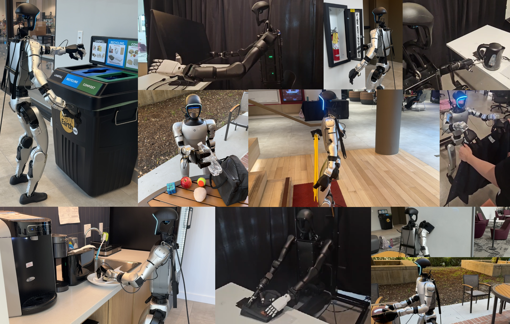
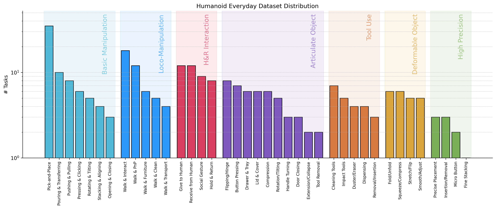

# Humanoid Everyday Dataset




**The Humanoid Everyday Dataset** is a diverse collection of humanoid robot (Unitree G1 and H1) demonstrations recorded at 30 Hz across everyday tasks. This dataset supports research in robot learning, imitation, and perception.

---

## Overview

- **Total Download Size:** ~500 GB (across 250 tasks), over 100,000 time-step recorded
- **Tasks:** 260 diverse scenarios (loco-manipulation, basic manipulation, tool use, deformables, articulated objects, human–robot interaction)
- **Episodes per task:** 40
- **Recording Frequency:** 30 Hz

### **Modalities captured**

- **Low-dimensional:**

  - Joint states (arm, leg, hand)
  - IMU (orientation, accelerometer, gyroscope, RPY)
  - Odometry/Kinematics (position, velocity, orientation)
  - Hand pressure sensors (G1 only)
  - Teleoperator hands/head actions from Apple Vision Pro
  - Inverse kinematics data

- **High-dimensional:**

  - Egocentric RGB images (480x640x3, PNG)
  - Depth maps (480x640, uint16)
  - LiDAR point clouds (~6 k points per step, PCD)

Each episode is a continuous interaction sequence; use the provided dataloader for convenient access to both low‑dimensional streams and visual/lidar files.

---

## Quickstart

### Requirements

- **Python:** >= 3.8
- **Memory**: >= 16GB RAM recommended

### Install humanoid_everyday dataloader

```bash
git clone https://github.com/ausbxuse/Humanoid-Everyday
cd Humanoid-Everyday
pip install -e .
```

### Download dataset

Please visit [our task spreadsheet](https://docs.google.com/spreadsheets/d/158Wzf8Xywky3aHJSCfp3OZxf4bkhzAJdcG94eHf8gVc/edit?gid=1307250382#gid=1307250382) to download your task of interest.

### Example usage

```python
from humanoid_everyday import Dataloader

# Load your downloaded task's dataset zip file (e.g., the "push_a_button" task)
ds = Dataloader("~/Downloads/push_a_button.zip")
print("Episode length of dataset:", len(ds))

# Displaying high dimensional data at first episode, second timestep.
ds.display_image(0, 1)
ds.display_depth_point_cloud(0, 1)
ds.display_lidar_point_cloud(0, 1)
for i, episode in enumerate(ds):
    if i == 1:  # episode 1
        print("RGB image shape:", episode[0]["image"].shape)  # (480, 640, 3)
        print("Depth map shape:", episode[0]["depth"].shape)  # (480, 640)
        print("LiDAR points shape:", episode[0]["lidar"].shape)  # (~6000, 3)

        batch = episode[0:4]  # batch loading episodes
        print(batch[1]["image"].shape)
        print(batch[0]["image"].shape)
```

The `Dataloader` provides random access to episodes and time steps as a nested list `data[episode][step]`.

---

## Data Schema

Each time step is represented by a Python dictionary with the following fields:

```python
{
    # Scalar identifiers
    "time":       np.float64,                # UNIX timestamp (s)
    "robot_type": np.str_,                   # Robot model identifier (G1 only, H1_2 datasets do  not have this field)

    # Robot states
    "states": {
        "arm_state":   np.ndarray((14,),  dtype=np.float64),  # 14 joint angles
        # Arm joint indices
        #   0: LeftShoulderPitch
        #   1: LeftShoulderRoll
        #   2: LeftShoulderYaw
        #   3: LeftElbow
        #   4: LeftWristRoll
        #   5: LeftWristPitch
        #   6: LeftWristYaw
        #   7: RightShoulderPitch
        #   8: RightShoulderRoll
        #   9: RightShoulderYaw
        #  10: RightElbow
        #  11: RightWristRoll
        #  12: RightWristPitch
        #  13: RightWristYaw
        "leg_state":   np.ndarray((15 or 13,),  dtype=np.float64),  # 15 joint angles for G1, 13 for H1_2

        # Leg/waist joint indices
        #   0: LeftHipYaw
        #   1: LeftHipRoll
        #   2: LeftHipPitch
        #   3: LeftKnee
        #   4: LeftAnkle
        #   5: LeftAnkleRoll
        #   6: RightHipYaw
        #   7: RightHipRoll
        #   8: RightHipPitch
        #   9: RightKnee
        #  10: RightAnkle
        #  11: RightAnkleRoll
        # Waist
        #  12: kWaistYaw
        #  [13]: kWaistRoll # G1 only
        #  [14]: kWaistPitch # G1 only
        "hand_state":  np.ndarray((14 or 12,),  dtype=np.float64),  # 14 joint angles for Unitree Dex3 Hand, 12 for Inspire Dextrous Hand
        # Dex3 Hand joint indices
        #   0: LeftThumbRotation
        #   1: LeftThumbLowerMotor
        #   2: LeftThumbUpperMotor
        #   3: LeftMiddleFingerLowerMotor
        #   4: LeftMiddleFingerUpperMotor
        #   5: LeftIndexFingerLowerMotor
        #   6: LeftIndexFingerUpperMotor
        #   7: RightThumbRotation
        #   8: RightThumbLowerMotor
        #   9: RightThumbUpperMotor
        #  10: RightMiddleFingerLowerMotor
        #  11: RightMiddleFingerUpperMotor
        #  12: RightIndexFingerLowerMotor
        #  13: RightIndexFingerUpperMotor

        # Inspire hand
        #   0: LeftPinkyBending
        #   1: LeftRingBending
        #   2: LeftMiddleBending
        #   3: LeftIndexBending
        #   4: LeftThumbBending
        #   5: LeftThumbRotating
        #   6: RightPinkyBending
        #   7: RightRingBending
        #   8: RightMiddleBending
        #   9: RightIndexBending
        #   10: RightThumbBending
        #   11: RightThumbRotating

        "hand_pressure_state": [                                # List of per-sensor readings (9 sensors per hand)
            {
                "sensor_id":       np.int32,
                "sensor_type":     np.str_,                    # "A" or "B"
                "usable_readings": np.ndarray((3,), dtype=np.float64)  # Up to 4 pressure values
            },
            …  # one entry per sensor
        ],

        "imu": {
            "quaternion":    np.ndarray((4,), dtype=np.float64),  # [w, x, y, z]
            "accelerometer": np.ndarray((3,), dtype=np.float64),  # [ax, ay, az]
            "gyroscope":     np.ndarray((3,), dtype=np.float64),  # [gx, gy, gz]
            "rpy":           np.ndarray((3,), dtype=np.float64)   # [roll, pitch, yaw]
        },

        "odometry": {
            "position": np.ndarray((3,), dtype=np.float64),  # [x, y, z]
            "velocity": np.ndarray((3,), dtype=np.float64),  # [vx, vy, vz]
            "rpy":      np.ndarray((3,), dtype=np.float64),  # [roll, pitch, yaw]
            "quat":     np.ndarray((4,), dtype=np.float64)   # [w, x, y, z]
        }
    },

    # Control commands and solutions
    "actions": {
        "right_angles": np.ndarray((7,),  dtype=np.float64),  # commanded joint angles
        "left_angles":  np.ndarray((7,),  dtype=np.float64),  # commanded joint angles
        "armtime":      np.float64,                         # timestamp
        "iktime":       np.float64,                         # timestamp

        "sol_q":        np.ndarray((14,), dtype=np.float64),  # solution joint angles
        "tau_ff":       np.ndarray((14,), dtype=np.float64),  # feedforward torques

        "head_rmat":    np.ndarray((3, 3),dtype=np.float64),  # rotation matrix
        "left_pose":    np.ndarray((4, 4),dtype=np.float64),  # homogeneous transform
        "right_pose":   np.ndarray((4, 4),dtype=np.float64)   # homogeneous transform
    },

    # High-dimensional observations
    "image": np.ndarray((480, 640, 3), dtype=np.uint8),     # RGB image
    "depth": np.ndarray((480, 640),      dtype=np.uint16),  # Depth map
    "lidar": np.ndarray((~6000, 3),      dtype=np.float64) # around 6000 points for lidar point cloud
}
```

---

## Raw Data Organization

If you wish to use your own custom loader, here is the directory outline of Humanoid Everyday's raw data for a single task

```
<task_name>/
├── episode_0/
│   ├── data.json       # Low‑dimensional sensor/action data + file paths
│   ├── color/          # RGB images (480×640×3, PNG)
│   ├── depth/          # Depth maps (480×640, uint16)
│   └── lidar/          # LiDAR point clouds (PCD files)
├── episode_1/
│   └── …
└── …
```

- **data.json:** Contains arrays of sensor readings and relative file paths for visual/lidar data.
- **color/**, **depth/**, **lidar/**: Raw files for each time step.

---

# Evaluation

You can evaluate your trained policy using the Humanoid Everyday dataset [here](https://humaoideveryday.com).

# License

This dataset is released under the MIT License
